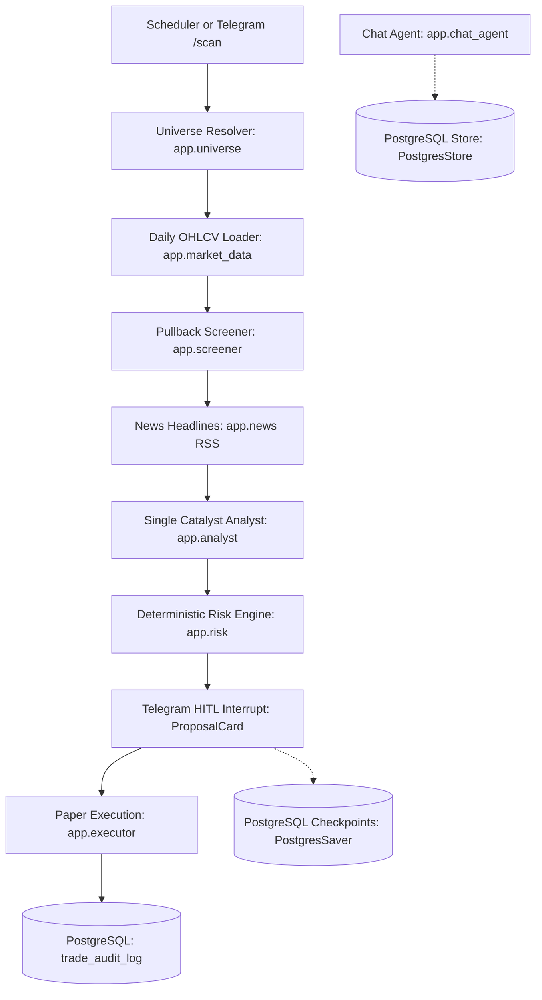
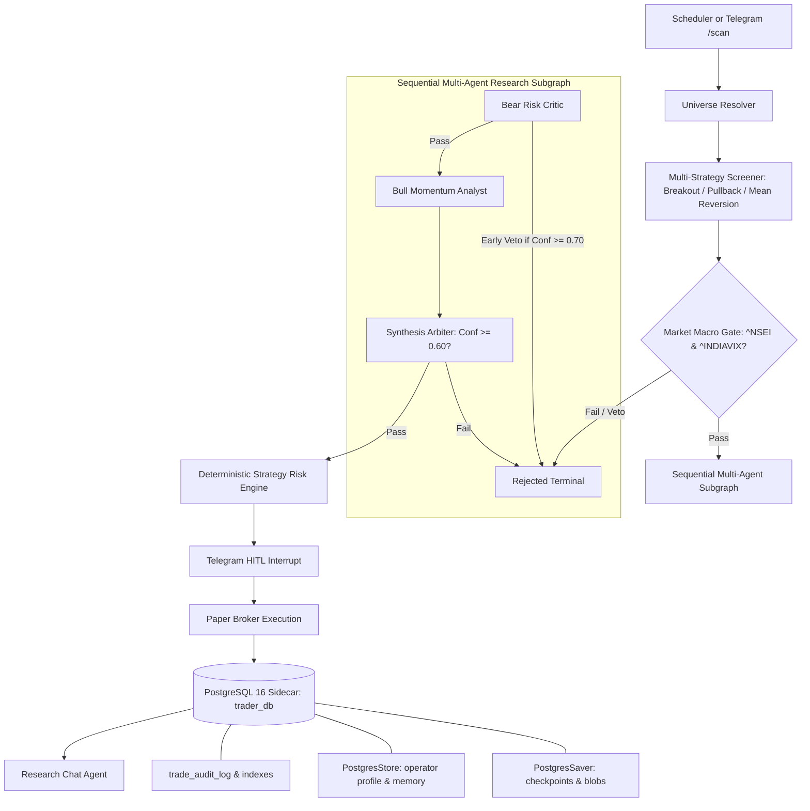

# Architecture

## Purpose

This system is a local-first NIFTY 100 cash-equity research and paper-trading
assistant. It produces auditable research proposals; it does not place live
orders. Telegram is the human control plane.

The next release is intentionally NIFTY 100-only. Broader NSE/BSE coverage is a
separate Phase 2 source-policy decision, not an implicit implementation task.

## Invariants

- The LLM classifies qualitative catalyst context only. It never supplies
  prices, stops, quantities, or orders.
- Risk calculations are deterministic and auditable.
- Missing or failed inputs fail closed for trade proposals.
- Live trading is blocked. Groww, if integrated, is read-only until a separate
  approved decision changes this constraint.
- Every decision and paper-trade state is persisted to PostgreSQL (ADR-023).
- NSE symbols in application state do not include `.NS`.
- External data must retain source, fetched time, freshness, and validation
  status.
- Evidence validation rejects missing/conflicting items and can enforce a
  configured global age limit through `EVIDENCE_MAX_AGE_SECONDS`.
- Market-data loading rejects missing OHLCV columns, non-numeric values, and
  negative volume before technical indicators are computed.

## Current Architecture

The codebase operates as a local-first, containerized, PostgreSQL-backed
decision-support assistant:

### Key Architectural Characteristics:
- **Persistence:** Unified PostgreSQL 16 sidecar container (`trade_audit_log`, `checkpoints`, `store`, `notification_outbox`, `research_cache`, `evidence_snapshots`).
- **Screening:** Deterministic setup screening computing EMA 200, RSI 14, ATR 14, and 20-day volume average.
- **Qualitative Analysis:** Monolithic structured LLM call in `app/analyst.py` classifying catalyst context.
- **Deployment:** Two services (`app` and `postgres:16-alpine` sidecar) managed via Docker Compose.
- **Risk Engine:** Pure Python deterministic math enforcing ATR stops and 1% risk per trade.

---

## Target Modernized Architecture (To-Be / Phase 6 Blueprint)

Approved by architectural consensus (ADR-011, ADR-022, ADR-023, ADR-024), the system
evolves into a multi-strategy, multi-agent, containerized platform backed by
PostgreSQL:

### Key To-Be Advancements:
1. **Unified Persistence (ADR-023):** Single PostgreSQL 16 sidecar container replaces all SQLite files, eliminating file locks and supporting concurrent multi-process operations.
2. **Multi-Strategy Simultaneous Screening (ADR-024):** Evaluates Breakout, Pullback, and Mean Reversion setups simultaneously with deterministic priority resolution.
3. **Macro Regime Filter (ADR-011):** Sourced from Yahoo Finance (`^NSEI`, `^INDIAVIX`). Blocks entries if VIX > 24 or NIFTY < 50 EMA; halves risk if VIX in [19, 24].
4. **Sequential Multi-Agent Research (ADR-022):** Bear Critic runs first for early exit (saving ~60% LLM cost), followed by Bull Analyst and Synthesis Arbiter.
5. **Advanced Evaluation & Benchmarking (T-007):** Compares paper alpha against NIFTY 100 Buy-and-Hold with a 30-trade minimum sample size rule, Profit Factor, and Realized R-multiples.

---

## Architectural Evolution Matrix

| Area | Current As-Is State | Target To-Be State | Task ID | ADR |
|---|---|---|---|---|
| **Persistence** | Unified PostgreSQL 16 sidecar container | PostgreSQL 16 with replication / cold backups | T-026 | ADR-023 |
| **Screener** | Single strategy (`pullback_in_uptrend`) | Simultaneous multi-strategy (`BREAKOUT`, `PULLBACK`, `MEAN_REVERSION`) | T-028 | ADR-024 |
| **Macro Gates** | Deterministic evaluator with manual mock | Automated Yahoo Finance `^NSEI` and `^INDIAVIX` live ingestion | T-004 | ADR-011 |
| **Qualitative Research** | Single monolithic prompt in `analyst.py` | Sequential multi-agent subgraph (Bear $\rightarrow$ Bull $\rightarrow$ Synth) with early exit | T-029 | ADR-022 |
| **Data Contracts** | Loose dictionaries passing between stages | Typed Pydantic models in `app/models.py` | T-027 | ADR-003 |
| **Credentials** | Plain `str` fields in `settings.py` | Pydantic `SecretStr` preventing secret leaks | T-027 | ADR-001 |
| **Concurrency** | Unbounded threads in `telegram_bot.py` | Bounded `ThreadPoolExecutor(max_workers=3)` + tenacity retries | T-030 | ADR-019 |
| **Evaluation** | Basic net P&L and win rate | NIFTY 100 Buy-and-Hold benchmark, Profit Factor, R-multiples, `/performance` | T-007 | ADR-011 |
| **Backtesting** | None (paper live forward testing only) | Event-driven walk-forward backtester reusing production pipeline | T-031 | ADR-012 |

## Target Research Architecture

The target system is a staged, evidence-driven pipeline:

1. **Ingestion** collects universe, prices, volume, indices, news,
   announcements, fundamentals, corporate actions, and optional read-only
   portfolio state.
2. **Normalization** converts all sources into stable internal schemas keyed by
   symbol, ISIN, source, and event time.
3. **Validation** checks schema, timestamps, trading days, duplicates, missing
   values, stale data, and cross-source price disagreement.
4. **Feature computation** calculates technical, regime, sector, liquidity,
   event, and portfolio features deterministically.
5. **Research agents** gather and summarize evidence. Agents may explain and
   classify; they may not change deterministic facts or risk values.
6. **Policy gates** reject incomplete, stale, contradictory, structurally risky,
   or over-exposed candidates.
7. **Report generation** produces a cited research brief and, separately, a
   deterministic paper proposal when all gates pass.
8. **Human review** is required before any paper state change.
9. **Evaluation** compares proposals with later outcomes and records source and
   model quality.

## Readiness Constraints

- The evidence snapshot is one immutable record shared by research reports and
  evaluation; the current implementation persists the snapshot in PostgreSQL.
- Official exchange and index pages are authoritative but are not assumed to be
  stable APIs. Collection must be cache-first, rate-limited, disableable, and
  terms-reviewed.
- Freshness, source-disagreement, event-blackout, exposure, and citation
  thresholds require explicit documented decisions before implementation. Phase
  2 is the discussion gate for those decisions.
- Market-regime work can proceed independently of corporate-event ingestion;
  event-based vetoes depend on T-003.

## Agent Boundaries

- **Research planner:** decomposes a question into evidence requirements.
- **Data collector:** invokes approved source adapters and stores raw evidence.
- **Data validator:** checks freshness, schema, identity, and conflicts.
- **Fundamental analyst:** summarizes validated fundamentals and disclosures.
- **Technical analyst:** reports deterministic indicators and regime context.
- **Bear Risk Critic Agent:** adversarial risk analyst testing for governance, debt, promoter pledging, and resistance; holds early veto authority (ADR-022).
- **Bull Momentum Analyst Agent:** evaluates volume breakout quality, sector rotation tailwinds, and trend strength.
- **Synthesis Arbiter Agent:** balances bull and bear evidence, assigning objective confidence scores (0-100) and invalidating criteria.
- **Risk engine:** deterministic Python only; no LLM invocation.
- **Report writer:** assembles evidence, uncertainty, and decision rationale.
- **Chat agent:** read/trigger-only; cannot approve, reject, or execute. Built
  with LangChain's `create_agent` (ADR-020), with `PIIMiddleware`,
  `ToolCallLimitMiddleware`, and `SummarizationMiddleware` for input hygiene,
  runaway-loop protection, and bounded conversation memory.
- **Human operator:** final decision for paper actions.

## Modernization Scope

- Safe scope includes CI hardening, async lifecycle correctness, typed reducer
  state where needed, research fan-out experiments, richer market context,
  specialized qualitative analysts, and realistic paper-cost accounting.
- PostgreSQL 16 running as a Docker sidecar service (`postgres:16-alpine`) is the
  unified persistence system for checkpoints, long-term store, audit logs,
  outbox, and research caching (ADR-023, superseding ADR-006/012/019).
- Checkpoints use `langgraph-checkpoint-postgres` (`PostgresSaver`) backed by a
  connection pool (`psycopg_pool.ConnectionPool`), preserving `durability="sync"`.
- Long-term memory uses `langgraph.store.postgres` (`PostgresStore`).
- Time-travel auditability is maintained via `graph.symbol_history` and exposed
  via the `history` CLI and chat-agent tools.
- Optional LangSmith tracing is supported via `LANGSMITH_TRACING_ENABLED` (ADR-021),
  failing closed without an API key.
- The current universe is intentionally narrow. TrAId starts with NIFTY 100 and
  may accept user-provided lists before any broader NSE/BSE security-master work
  is authorized.
- Groww/Zerodha GTT and live order routing are explicitly out of the current
  scope. They require T-008 and a new accepted execution ADR.

## Implemented Deepening Seams

- `app.market_data` owns OHLCV loading and provenance so the screener's single-
  symbol and universe paths share the same source seam.
- `app.checkpoint` owns the process-wide PostgreSQL connection pool and `PostgresSaver`,
  shared by the graph and chat agent.
- `app.store` owns the process-wide PostgreSQL connection pool and native LangGraph
  `PostgresStore`, compiled into the graph via `compile(store=...)`. It backs
  `app.profile` (operator profile) as a genuine long-term-memory namespace
  instead of an ad hoc table, and is the seam for any future cross-thread
  research notes.
- `graph.symbol_history` exposes LangGraph's native checkpoint history
  (time travel) as a read-only audit trail: every node transition, whether a
  step paused for human approval, and the state at each step. It is available
  through `python -m app.main history SYMBOL` and the chat agent's
  `get_symbol_history` tool, so "why was X rejected/approved" never requires
  re-running the pipeline or reading raw logs.
- `graph.run_symbol` and `graph.resume_symbol` invoke with `durability="sync"`
  so every super-step of a paper-trading approval is durably persisted before
  the next node starts.
- `app.chat_agent` is built with LangChain's `create_agent` (ADR-020, not the
  deprecated `create_react_agent`), with `PIIMiddleware`,
  `ToolCallLimitMiddleware`, and `SummarizationMiddleware` for input hygiene,
  runaway tool-call protection, and bounded conversation memory — all built
  into the already-installed `langchain` package.
- `ProposalCard` in `app.state` is the validated contract crossing the graph
  interrupt and Telegram renderers.
- `app.universe` reuses resolved rows until an explicit refresh or test reset,
  avoiding repeated cache parsing during a scan.
- Universe expansion is not automatic. Full NSE/BSE security-master sourcing is
  a separate discussion task and must define source authority, freshness, and
  required metadata before implementation.
- `app.regime` provides a tested deterministic India VIX/NIFTY EMA evaluator and
  the pipeline accepts an assessment for fail-closed scan gating. Live index
  ingestion remains deferred until an approved source and ADR-011 thresholds
  exist. `app.risk` owns circuit/surveillance rejection context and delivery-cost
  math.
- `app.executor` records gross P&L, transaction costs, and net realized P&L for
  paper trades.
- Scan outputs and research artifacts are reused when their inputs are unchanged;
  T-018 provides PostgreSQL-backed TTL cache entries for derived technical
  snapshots, RSS headlines, catalyst results, and stable evidence snapshots.
  Technical and evidence cache hits are persisted with paper-trade attribution;
  RSS/catalyst cache-hit attribution and raw OHLCV remain follow-up work.
- `app.evidence` normalizes provenance-bearing market/news items into immutable
  PostgreSQL evidence snapshots. Graph runs persist the snapshot ID and source set
  into paper-trade audit rows. Reuse and cache invalidation remain T-018 work.
- `app.corporate_events` owns normalized event identity, deterministic
  deduplication, evidence conversion, and the configurable projected-holding
  window blackout policy. Its source adapter is disabled by default and uses a
  cache-first fallback; exchange-specific endpoint wiring remains pending until
  access terms and schema are approved.
- Runtime input handling canonicalizes NSE symbols before market-data access,
  and Telegram handlers use `effective_message` so callback/non-message update
  shapes do not crash command processing.
- LLM timeout and retry counts are configuration values; analyst failures still
  fail closed instead of blocking the scheduler indefinitely.
- LangGraph state and notification outbox payloads persist JSON-safe mappings,
  not Pydantic instances. This avoids strict MsgPack allowlist warnings and
  keeps checkpoint deserialization forward-compatible.
- `serve` owns the scheduler and Telegram bot lifecycles. `Ctrl+C` stops both
  explicitly and waits briefly for the bot thread instead of relying on daemon
  thread termination.
- Telegram remains one module intentionally. The outbox is the existing seam;
  split transport work only when a second notification adapter is real.
- T-014 selects one LLM provider at process startup through
  `LLM_PROVIDER`. It uses native LangChain adapters for OpenAI, Gemini,
  Anthropic, and Groq, plus one explicit OpenAI-compatible gateway adapter.
  Provider selection is configuration-only, fails closed when unconfigured, and
  can never be changed by an agent. Non-secret provider/model metadata is stored
  in graph context for research attribution.
- `TrAId` is a single-operator, direct-message Telegram control plane. The
  configured chat id is now enforced for commands, free text, and approval
  callbacks. Current chat history is checkpointed per Telegram chat; T-015
  still needs bounded factual memory and an explicit operator profile.
- Persistence is unified under PostgreSQL 16 (`trader_db`) running as a Docker
  sidecar container (ADR-023).
- Database maintenance is explicit: `check-databases` runs PostgreSQL integrity
  and table liveness checks.
- `app.evaluation` computes deterministic paper-trade metrics from audit rows;
  evaluation has no permission to change strategy, thresholds, risk, or orders.
- `app.health` provides read-only operational status. Telegram `/status` uses
  the same service and cannot approve, reject, execute, or mutate configuration.
- The scan pipeline records per-symbol and aggregate duration logs before any
  concurrency change. Fan-out must be justified by these measurements and keep
  the same shared `/run` and `/scan` per-symbol path.

## Persistence

Persistence is unified under PostgreSQL 16 (`trader_db`) running as a Docker
sidecar container (ADR-023):

- `checkpoints`, `checkpoint_blobs`, `checkpoint_writes`: LangGraph state and
  durable interrupts managed via `PostgresSaver` with connection pooling.
- `store`: LangGraph long-term-memory store (operator profile and cross-thread
  research memory) managed via `PostgresStore`.
- `trade_audit_log`: Paper-trade fills, net P&L, transaction costs, execution
  records, and research attribution, indexed on `status`, `timestamp`, and `symbol`.
- `notification_outbox`: At-least-once Telegram notification delivery queue.
- `research_cache`: TTL-governed cache for technical snapshots, RSS headlines,
  and research verdicts.
- `evidence_snapshots`: Immutable JSON evidence payloads with source provenance.
- `graph_threads`: Active thread indexing for time-travel queries.
- `data/universe/`: Runtime local cache for NIFTY 100 constituent CSV files.

## Failure Policy

- Source failure: use an explicitly ranked fallback and record the fallback.
- Missing evidence: produce a research-only result or reject the proposal.
- Conflicting evidence: surface the conflict and do not silently choose.
- LLM failure: conservative classification or research-only output.
- Stale price or event data: no proposal.
- Database failure: do not claim success or execute paper state changes.

## Security and Cost

- Secrets remain in `.env` or deployment secret storage and never enter logs,
  prompts, reports, checkpoints, or telemetry.
- Start with public/free sources and local caching.
- API keys are optional per adapter, not globally required.
- Groww credentials are reserved for read-only account synchronization and are
  never passed to an order-capable agent.
- Broker GTT and live order methods remain fail-closed and are not exposed to
  research agents.

## Related Documents

- [Product requirements](prd.md)
- [Source and API reference](reference.md)
- [Architecture decisions](architecture-decisions.md)
- [Implementation tasks](tasks.md)
