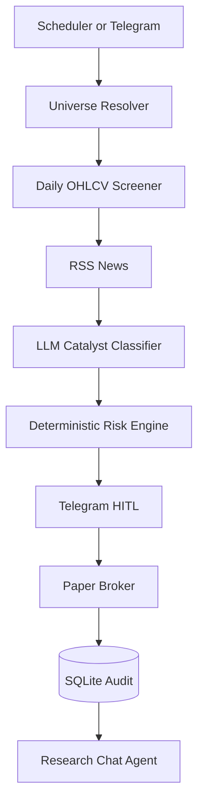

# Architecture

## Purpose

This system is a local-first NIFTY 100 cash-equity research and paper-trading
assistant. It produces auditable research proposals; it does not place live
orders. Telegram is the human control plane.

## Invariants

- The LLM classifies qualitative catalyst context only. It never supplies
  prices, stops, quantities, or orders.
- Risk calculations are deterministic and auditable.
- Missing or failed inputs fail closed for trade proposals.
- Live trading is blocked. Groww, if integrated, is read-only until a separate
  approved decision changes this constraint.
- Every decision and paper-trade state is persisted to SQLite.
- NSE symbols in application state do not include `.NS`.
- External data must retain source, fetched time, freshness, and validation
  status.

## Current System

## Components

| Area | Current implementation | Planned extension |
| --- | --- | --- |
| Universe | Official NIFTY 100 CSV, cache, seed fallback | Broader index and sector universes |
| Market data | `yfinance` daily OHLCV | Source adapter, validation, fallback provider |
| Technicals | EMA 200, RSI 14, ATR 14, volume average | Regime, breadth, relative strength, multi-timeframe data |
| News | Three RSS feeds with simple name matching | Announcements, filings, events, deduplication, provenance |
| Qualitative analysis | Structured LLM catalyst classification | Multi-source research synthesis with citations and confidence |
| Risk | ATR stops, 1% sizing, R:R gate | Exposure, correlation, event, liquidity, and portfolio-level gates |
| Approval | Telegram inline buttons | Research reports, explicit read-only broker context |
| Execution | SQLite paper broker | No live execution in current scope |
| Persistence | Audit DB, checkpoints, outbox | Research artifact and data snapshot storage |
| Operations | Docker, scheduler, OpenTelemetry boundary | Health, freshness, data-quality and evaluation metrics |

## Target Research Architecture

The target system is a staged, evidence-driven pipeline:

1. **Ingestion** collects universe, prices, volume, indices, news,
   announcements, fundamentals, corporate actions, and optional read-only
   portfolio state.
2. **Normalization** converts all sources into stable internal schemas keyed by
   symbol, ISIN, source, and event time.
3. **Validation** checks schema, timestamps, trading days, duplicates, missing
   values, stale data, and cross-source price disagreement.
4. **Feature computation** calculates technical, regime, sector, liquidity,
   event, and portfolio features deterministically.
5. **Research agents** gather and summarize evidence. Agents may explain and
   classify; they may not change deterministic facts or risk values.
6. **Policy gates** reject incomplete, stale, contradictory, structurally risky,
   or over-exposed candidates.
7. **Report generation** produces a cited research brief and, separately, a
   deterministic paper proposal when all gates pass.
8. **Human review** is required before any paper state change.
9. **Evaluation** compares proposals with later outcomes and records source and
   model quality.

## Agent Boundaries

- **Research planner:** decomposes a question into evidence requirements.
- **Data collector:** invokes approved source adapters and stores raw evidence.
- **Data validator:** checks freshness, schema, identity, and conflicts.
- **Fundamental analyst:** summarizes validated fundamentals and disclosures.
- **Technical analyst:** reports deterministic indicators and regime context.
- **Catalyst analyst:** classifies evidence with structured output and citations.
- **Risk engine:** deterministic Python only; no LLM invocation.
- **Report writer:** assembles evidence, uncertainty, and decision rationale.
- **Chat agent:** read/trigger-only; cannot approve, reject, or execute.
- **Human operator:** final decision for paper actions.

## Persistence

- `data/trading_audit.db`: decisions, proposals, paper trades, source metadata,
  research reports, and evaluation outcomes.
- `data/checkpoints.db`: LangGraph state and durable interruptions.
- `data/universe/`: runtime universe cache and metadata.
- Future raw research files should be content-addressed or timestamped and
  referenced from SQLite rather than embedded in graph state.

## Failure Policy

- Source failure: use an explicitly ranked fallback and record the fallback.
- Missing evidence: produce a research-only result or reject the proposal.
- Conflicting evidence: surface the conflict and do not silently choose.
- LLM failure: conservative classification or research-only output.
- Stale price or event data: no proposal.
- Database failure: do not claim success or execute paper state changes.

## Security and Cost

- Secrets remain in `.env` or deployment secret storage and never enter logs,
  prompts, reports, checkpoints, or telemetry.
- Start with public/free sources and local caching.
- API keys are optional per adapter, not globally required.
- Groww credentials are reserved for read-only account synchronization and are
  never passed to an order-capable agent.

## Related Documents

- [Product requirements](prd.md)
- [Source and API reference](reference.md)
- [Architecture decisions](architecture-decisions.md)
- [Implementation tasks](tasks.md)
