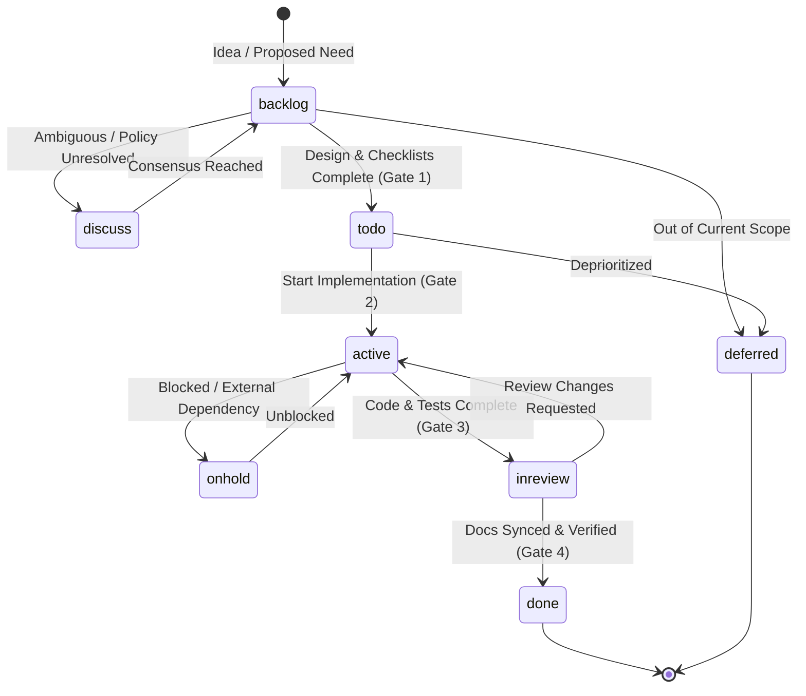
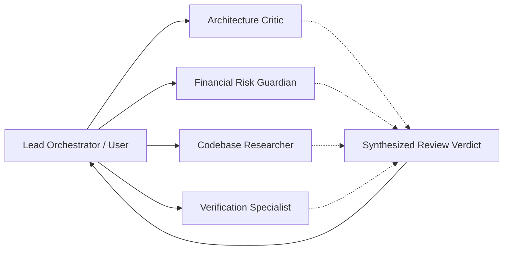

# SDLC Process & Agentic Governance Framework

This document is the canonical software development lifecycle (SDLC) and
governance guide for **TrAId (My Agentic Trader)**. It defines how human
operators and AI agents collaborate systematically across research,
brainstorming, architecture design, task tracking, implementation, and
verification.

---

## 1. Core Principles

1. **Documentation-First (Source of Truth):**
   Code is an artifact of documentation, not the other way around. Every
   architectural change, risk parameter, data source, and workflow state must be
   formally documented in `docs/` before code is written or modified.
2. **Deterministic Risk Separation:**
   Financial calculations (entry, stop loss, target, position sizing, delivery
   friction) are purely deterministic Python math (`app/risk.py`). Probabilistic
   LLMs classify qualitative context only and never emit numbers or order
   instructions.
3. **Fail-Closed Safety:**
   Missing data, stale feeds, LLM timeouts, network glitches, or unverified
   assumptions must always abort proposal generation rather than guess or allow a
   risky trade through.
4. **Controlled Multi-Agent Collaboration:**
   Agents must not hallucinate scope, assume requirements, or self-authorize
   architectural shifts. Multi-agent debate is structured into explicit roles
   with concrete veto and review gates.
5. **Traceable State & Auditability:**
   Every decision, research debate, human approval, and execution fill is
   immutably persisted to PostgreSQL (`trader_db`).

---

## 2. Task Lifecycle & Status Definitions

Every task in `docs/tasks.md` must carry exactly one valid status tag:



| Status | Meaning | Entry Requirements | Permitted Operations |
|---|---|---|---|
| `backlog` | Captured requirement or feature idea. Not yet ready for immediate coding. | Clear problem statement and desired outcome. | Research, refining acceptance criteria, breaking down sub-tasks. **No production code changes.** |
| `discuss` | Blocked on architectural decision, operator preference, or external policy terms (e.g., ADR required). | An explicit open question is documented under the task. | Brainstorming, multi-agent evaluation, running `/grill-me` interviews. **No production code changes.** |
| `todo` | Fully planned, bounded, and ready for implementation. | Passed **Gate 1**: nested hierarchy defined, ADRs accepted, acceptance criteria clear. | Setting up branch or test fixtures. Next in queue. |
| `active` | Actively being implemented. Maximum 1–2 concurrent active tasks to avoid context fragmentation. | Passed **Gate 2**: dependencies met, test strategy planned. | Writing code, creating unit tests, local verification. |
| `onhold` | Temporarily paused due to external blockers, missing API access, or upstream redesign. | Blocker explanation and unblocking condition documented. | Maintenance only. Blocked work paused. |
| `inreview` | Implementation and tests complete; awaiting multi-agent review or operator sign-off. | Passed **Gate 3**: all checklists ticked, automated tests passing, lint/types clean. | Multi-agent code review, architecture check, diff inspection. |
| `done` | Formally completed, verified, and canonical documentation updated. | Passed **Gate 4**: PRD, Architecture, Reference, and Tasks fully synchronized. Zero regressions. | Task ledger item finalized. |
| `deferred` | Intentionally excluded from current scope with recorded rationale. | Documented rationale in ADR or task ledger. | Archived for future major releases. |

---

## 3. Strict SDLC Gate Transitions

An agent or developer may **never** move a task forward without satisfying every
checkbox in the corresponding gate.

### Gate 1: Planning Gate (`backlog` / `discuss` $\rightarrow$ `todo`)
- [ ] Task scope is strictly bounded (no unbounded feature creep).
- [ ] Any required architectural choices have an accepted ADR in `docs/architecture-decisions.md`.
- [ ] Does not violate hard invariants (no live trading, LLM never touches numbers, fail-closed).
- [ ] Nested hierarchy is fully written: Task $\rightarrow$ Sub-Tasks $\rightarrow$ Milestones $\rightarrow$ Checklists.
- [ ] Clear, testable Acceptance Criteria are documented.

### Gate 2: Implementation Gate (`todo` $\rightarrow$ `active`)
- [ ] All prerequisite tasks are marked `done`.
- [ ] Concurrency check: no more than 2 tasks are currently marked `active`.
- [ ] Target files and dependencies are identified.
- [ ] Test fixtures and isolation strategies are planned.

### Gate 3: Verification Gate (`active` $\rightarrow$ `inreview`)
- [ ] All checklist items under every milestone in the task are checked `[x]`.
- [ ] Automated tests pass: `python -m pytest -q` exits with code 0.
- [ ] Static analysis passes: `ruff check app/ config/ tests/` has 0 errors.
- [ ] Type checking passes: `mypy app/ config/` has 0 errors.
- [ ] New functionality has dedicated unit/integration tests covering both happy path and failure/fallback modes.
- [ ] No secrets or keys are hardcoded; all configuration uses `config/settings.py` with `SecretStr`.

### Gate 4: Completion Gate (`inreview` $\rightarrow$ `done`)
- [ ] **PRD Synchronization:** `docs/prd.md` updated if feature capabilities, constraints, or metrics changed.
- [ ] **Architecture Synchronization:** `docs/architecture.md` updated if component data flow, persistence, or agent roles changed.
- [ ] **Reference Synchronization:** `docs/reference.md` updated if new sources, dependencies, or configuration keys were introduced.
- [ ] **Frontend Asset Build:** `cd frontend && npm run build` compiled with 0 errors.
- [ ] **Docker Container Build:** `docker compose build` (or `docker compose up --build -d`) executed so the latest containerized application is running and verifiable.
- [ ] **Walkthrough Created/Updated:** `walkthrough.md` summarizes the exact changes, test commands, and verification logs.
- [ ] Code reviewed against hard invariants by multi-agent review or human operator.

---

## 4. Nested Task Hierarchy Standard

Every task in `docs/tasks.md` must be formatted according to this exact
4-tier nested structure:

```markdown
### T-XXX Task Title
- Status: [backlog | discuss | todo | active | onhold | inreview | done | deferred]
- Priority: [Critical | High | Medium | Low]
- Related ADRs: [ADR-XXX]
- Goal: Concise 1-2 sentence statement of what this accomplishes.
- Context & Rationale: Why this is needed and how it fits into the platform architecture.

#### Sub-Task 1: Subsystem or Area Name
- Goal: Scoped objective of this sub-task.
- Milestone 1.1: Component or Capability Name
  - [ ] Specific, verifiable checklist action item
  - [ ] Specific, verifiable checklist action item
- Milestone 1.2: Component or Capability Name
  - [ ] Specific, verifiable checklist action item

#### Sub-Task 2: Testing & Verification
- Milestone 2.1: Automated Test Suite
  - [ ] Unit tests for component happy paths
  - [ ] Unit tests for component failure and fail-closed paths
- Milestone 2.2: Quality & Documentation
  - [ ] Ruff and Mypy validation
  - [ ] Documentation synchronization

#### Acceptance Criteria
1. Criterion 1 (concrete, testable condition).
2. Criterion 2 (concrete, testable condition).
```

---

## 5. Multi-Agent Review & Brainstorming Protocol

When researching, brainstorming, or reviewing complex tasks, avoid single-perspective
hallucinations by utilizing structured multi-agent personas:



### 1. Architecture Critic Persona
- **Mission:** Challenge unnecessary complexity, premature optimizations, circular dependencies, and architectural drift.
- **Key Questions:** Does this violate existing ADRs? Does this introduce unneeded services (e.g. DuckDB, Redis) when simpler tools suffice? Does this cleanly separate transport from domain logic?

### 2. Financial Risk Guardian Persona
- **Mission:** Protect financial invariants, regulatory guardrails, and deterministic execution boundaries.
- **Key Questions:** Can an LLM error cause money loss? Are stop-losses and position sizes 100% deterministic? Does this setup respect circuit limits, ASM/GSM surveillance, and corporate blackout windows? Is live trading strictly blocked?

### 3. Codebase Researcher Persona
- **Mission:** Inspect actual code, configuration, installed packages, and official documentation to verify facts before assuming.
- **Key Questions:** Does the installed version of `langgraph` or `psycopg` actually support this syntax? Is there an existing seam or utility function in `app/` that already does this?

### 4. Verification Specialist Persona
- **Mission:** Scrutinize test coverage, failure modes, error masking, and edge cases.
- **Key Questions:** What happens if the network drops mid-stream? Are broad `except Exception` blocks hiding critical errors? Are tests isolated using temporary directories?

---

## 6. Architecture Dual-State Representation

To eliminate confusion between what currently exists in the repository versus what
is planned for upcoming phases, `docs/architecture.md` must always maintain two
explicit sections:

1. **Current State Architecture (As-Is):**
   Reflects only code that is currently implemented and merged into `main`. Never
   claim a capability exists here before its task is `done`.
2. **Target Modernized Architecture (To-Be / Phase 6+):**
   Reflects the approved blueprint from accepted ADRs and active/todo tasks. Shows
   the migration path and evolution target.

---

## 7. Folder-Level Governance Architecture

To ensure localized discipline, specialized `AGENTS.md` instruction files are placed
in key project directories:

| Location | Scope & Invariants |
|---|---|
| `/AGENTS.md` (Root) | Project-wide invariants, CLI commands, control plane conventions, global SDLC gates. |
| `docs/AGENTS.md` | Canonical documentation rules, ADR acceptance standards, task ledger formatting. |
| `app/AGENTS.md` | Core application rules: pure Python risk math, fail-closed handlers, typed models, secret masking. |
| `tests/AGENTS.md` | Testing rules: tmp_path isolation, mock external network, deterministic fixtures, coverage standards. |
| `config/AGENTS.md` | Configuration rules: `get_settings()` singleton, `SecretStr` for credentials, `.env` synchrony. |
